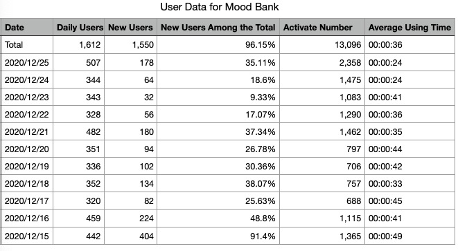
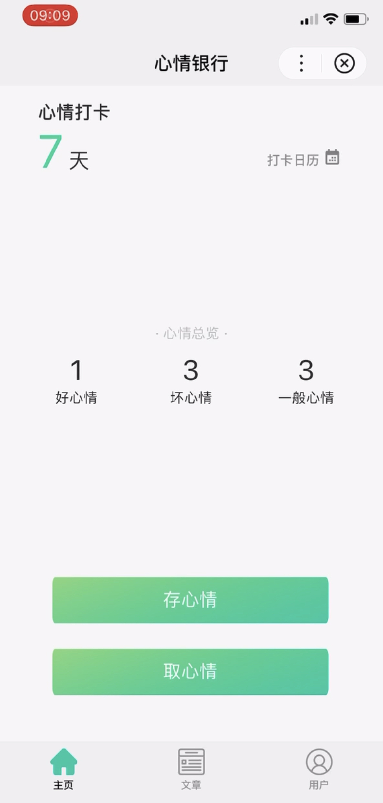
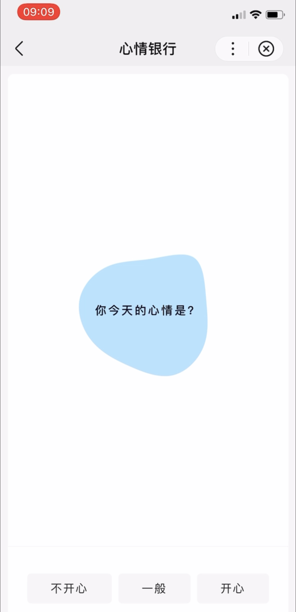
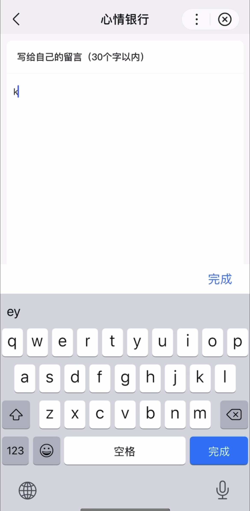

# Moon-Bank-BaiduMiniProgram
This an online mood tracker used the Mini Program Framework from Baidu.
We were ranked #13 among over 100 teams in the Smart Mini Program Development Competition hosted by Baidu, one of the largest tech companies in China. The Mini Program Framework is an open-source mobile application framework used JavaScript.          

There were 1612 active users who used our mood tracker to record their daily moods. From Dec 15th 2020 to Dec 25th 2020, we have over 3500 daily mood records.

User Data

User Interface

